# GGHI HR Portal — User Guide

**For:** Employees, Approvers (Department Heads, Managers, HR, Medical Director, CEO)
**Covers:** Leave requests, overtime, time corrections, trip tickets, payslips, and approvals.

---

## 1. Logging In

1. Go to the portal login page.
2. Sign in with your **Employee Code** and **password** (given by HR).
3. On first login, you may be asked to change your password — do this immediately and keep it private.
4. Forgot your password? Contact HR/Admin to have it reset — there is no self-service reset.

The portal works on desktop and mobile (phone/tablet). On mobile, use the bottom navigation bar; on desktop, use the sidebar.

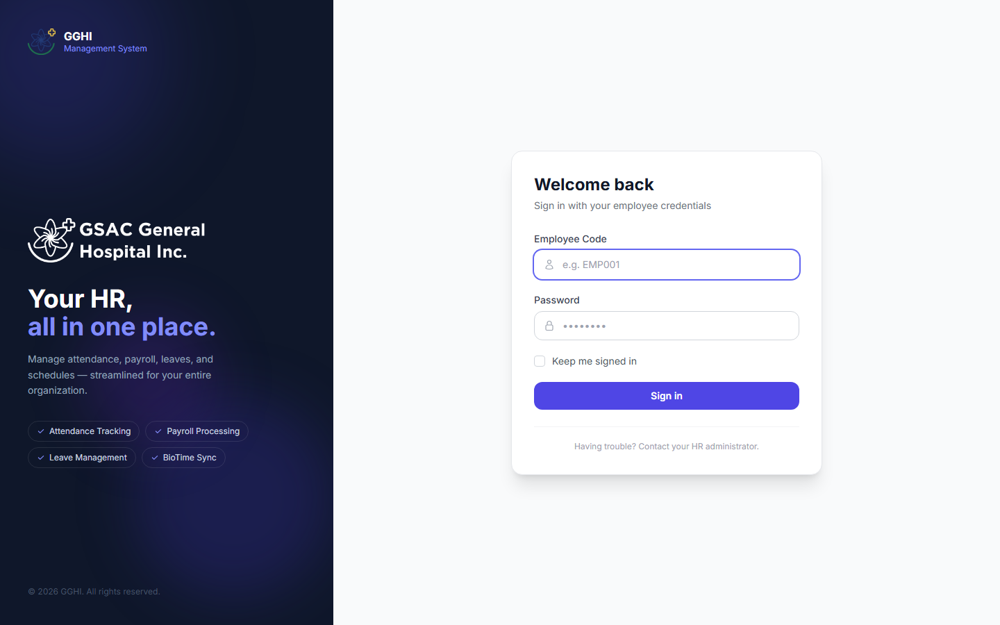

---

## 2. Roles at a Glance

| Role | What they do |
|---|---|
| **Employee** | Files leave, overtime, time correction, and trip ticket requests. Views own payslips and attendance. |
| **Department Head / Manager** | Everything an employee can do, **plus** approves leave/time-correction/trip-ticket requests at **Step 1**. |
| **HR Admin** | Approves at **Step 2**, manages employees, payroll, schedules, and all HR records. |
| **Approver (Medical Director)** | Approves leave/time-correction requests at the final step (**Step 3**). |
| **Super Admin (CEO)** | Final approver (**Step 3**) plus full system access. |
| **Head Nurse** | Manages the Nursing duty roster; otherwise uses the app like a regular employee. |

Your role determines what you see in the sidebar/menu — you won't see options you don't have access to.

---

## PART A — For Employees

### A.1 Dashboard

Your dashboard shows a snapshot of your leave balances, recent attendance, and quick links to file requests.

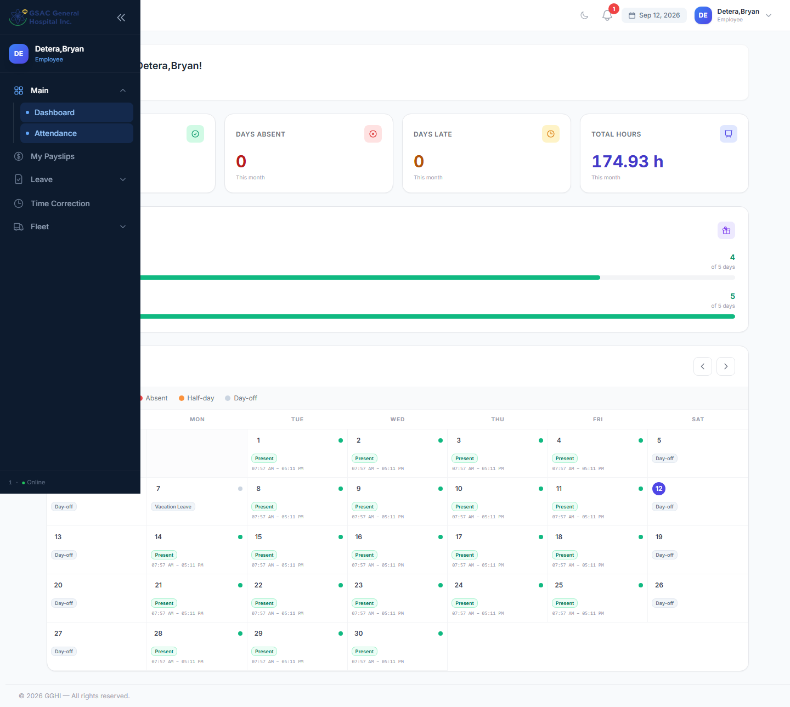

### A.2 Filing a Leave Request

**Menu:** Leave → Request Leave

1. Check **My Leave Balances** at the top of the page — shows remaining days per leave type (VL, SL, EL, etc.) for the current year.
2. Select a **Leave Type**. Your remaining credit for that type appears below the dropdown.
3. Toggle **Half Day** if you only need part of a day off (deducts 0.5 day).
4. Pick your **Start Date** (and **End Date**, if not half-day). The system shows the total working days that will be deducted (Sundays and your day-off are excluded automatically).
5. Enter a **Reason**.
6. Click **Submit Request**.

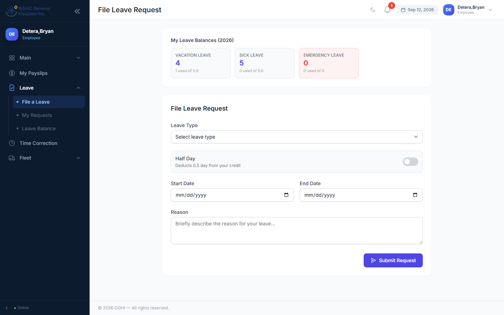

Your request now enters the approval chain (see [A.6](#a6-tracking-approval-status)).

**Cancelling:** Go to **Leave → My Requests**. You can cancel a request only while it's still **Pending**.

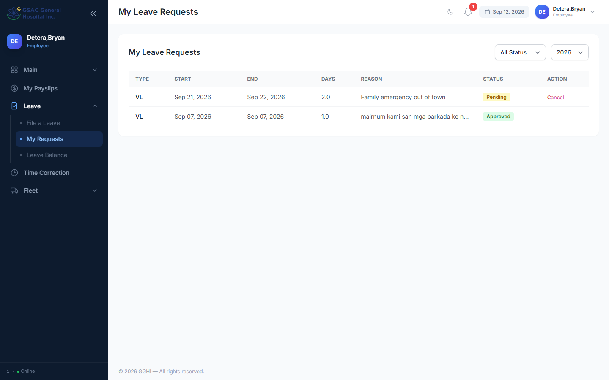

### A.3 Filing Overtime

**Menu:** Overtime → Request Overtime

1. Enter the **Date of Overtime**.
2. Enter **Requested OT Hours** (0.5–8 hours).
3. Give a **Reason/Purpose**.
4. Submit. Your OT list below the form shows status, and the **Approved Hours** may differ from what you requested (approvers can adjust it).

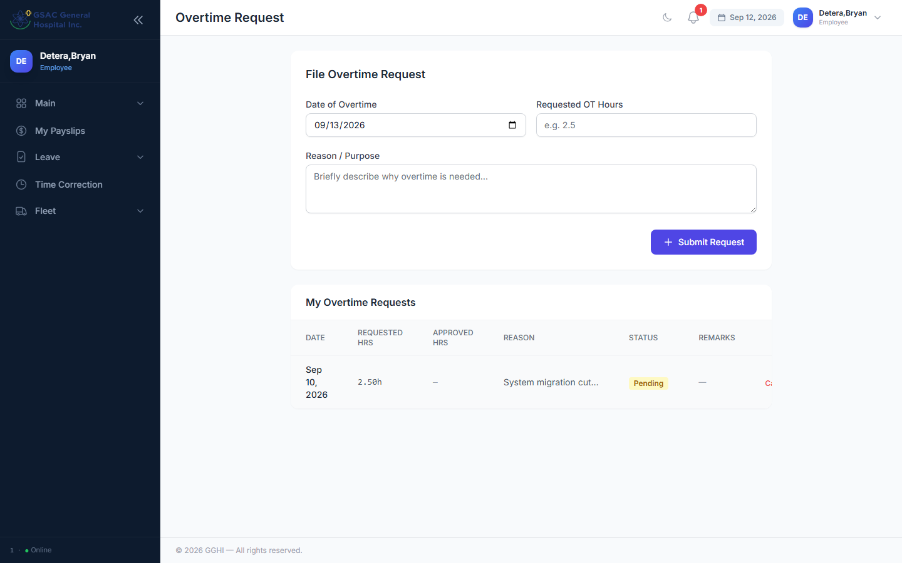

You can **Cancel** a pending OT request from the same page.

### A.4 Requesting a Time Correction

Use this when your biometric time-in/out was missed or wrong (forgot to tap, device error, etc.).

**Menu:** Attendance → Time Correction

1. Pick the **Date to Correct** (cannot be a future date).
2. Fill in **only** the time field(s) that need fixing — AM Time In/Out, PM Time In/Out. Leave the rest blank to keep your original biometric punch.
3. Give a **Reason**.
4. Submit. Once approved, the corrected time is reflected in your attendance and used for payroll — it also flows through the same approval chain as leave.

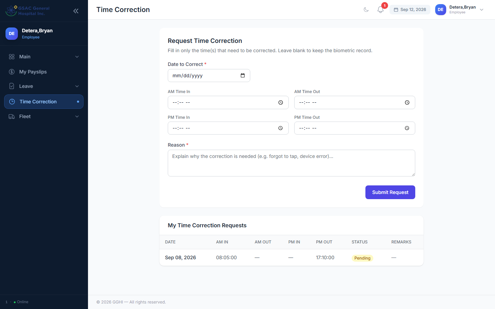

### A.5 Filing a Trip Ticket (Vehicle/Driver Request)

**Menu:** Fleet → Request Trip Ticket

1. Fill in origin/destination, departure date-time, purpose, and number of passengers/details as prompted.
2. Submit — it goes through a 3-step approval: **Immediate Head → HR Officer → Fleet** (Fleet assigns the actual vehicle/driver at the final step).
3. Track status at **Fleet → My Trip Tickets**, where you'll also see the assigned **Vehicle/Driver** once scheduled.
4. You can **Cancel** while still pending.
5. Once your trip is approved, "Mark Returned" is handled by the Fleet/HR office when the vehicle comes back — you don't need to do this yourself.

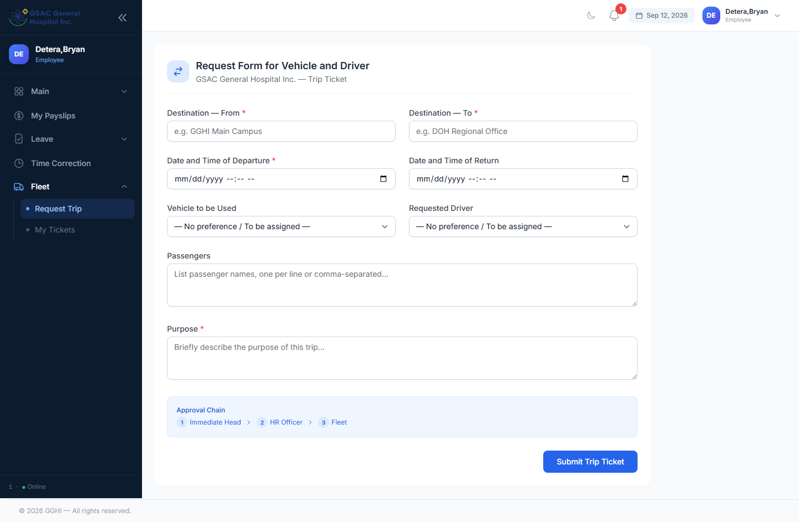

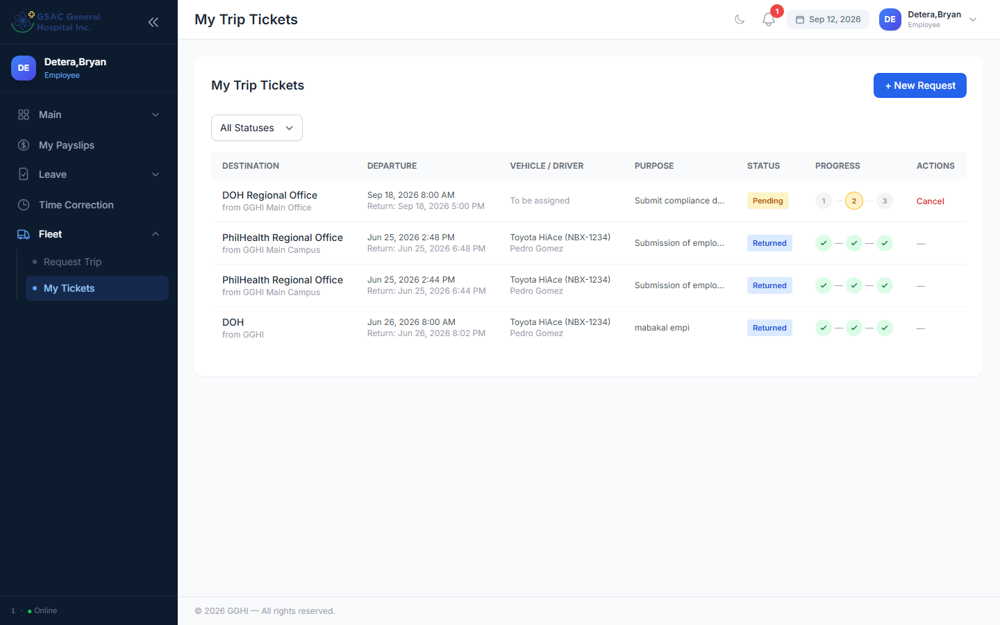

### A.6 Tracking Approval Status

Every leave, time-correction, and trip-ticket list shows an **approval progress** chain:
- **Grey circle** = not yet reached
- **Amber/highlighted circle** = currently awaiting action at this step
- **Green check** = approved at this step
- **Red X** = rejected — the request stops here

The leave/time-correction chain is:
1. **Department Head / Manager**
2. **HR**
3. **CEO / Medical Director**

*(Managers and Department Heads filing their own leave skip straight to Step 3 — HR is bypassed for their own requests.)*

The trip ticket chain is:
1. **Immediate Head**
2. **HR Officer**
3. **Fleet** (vehicle/driver assignment)

### A.7 Viewing Payslips

**Menu:** Payslips

- Lists all your finalized/processed payslips by payroll period.
- Click **Download** to get a PDF copy of any payslip.
- If a payslip isn't listed yet, payroll for that period hasn't been processed by HR — check back after the cutoff.

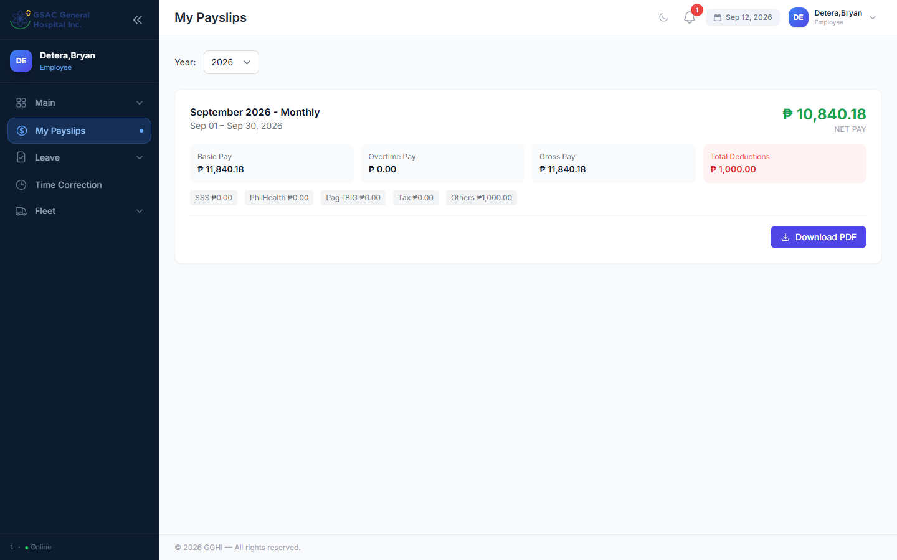

### A.8 Viewing Attendance

Your dashboard/attendance calendar shows daily status: **Present, Late, Absent, Half-day, Incomplete, Day-off**, or the name of an approved leave. If something looks wrong, file a **Time Correction** ([A.4](#a4-requesting-a-time-correction)) rather than waiting for payroll to fix it — corrections after payroll is finalized can't be applied retroactively.

### A.9 Profile

**Menu:** Profile — update your contact/cell number (used for SMS approval notifications) and change your password.

---

## PART B — For Approvers

Everything in Part A also applies to you for your **own** requests. This section covers approving **other employees'** requests.

### B.1 Where to Approve

| Request type | Menu (approver view) |
|---|---|
| Leave | Admin → Leave Approvals |
| Time Correction | Admin → Time Corrections |
| Trip Ticket | Admin → Fleet Requests |
| Overtime | Admin → Overtime *(HR/Super Admin only)* |

Each page shows a banner telling you which step you act at, e.g. *"You are HR — Step 2 of 3."* You will only see the **Approve/Reject** buttons on requests that are currently waiting at your step; requests at other steps show "Not your step."

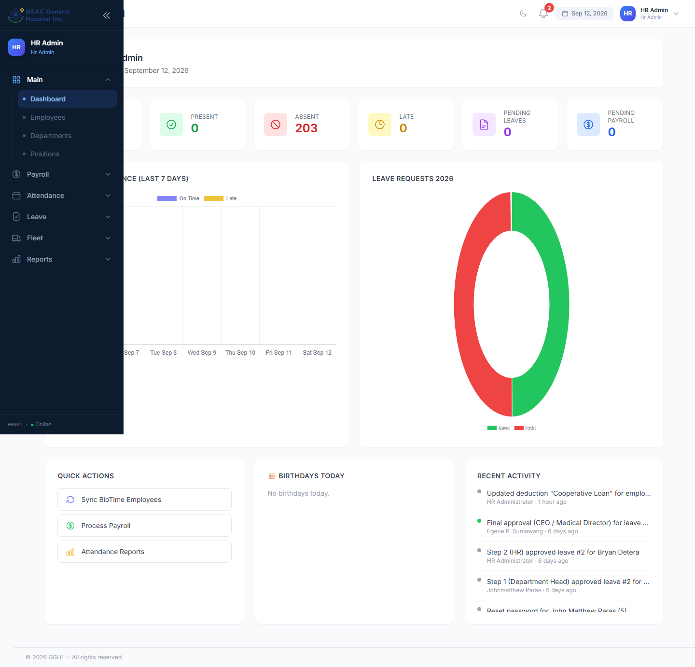

### B.2 Approving or Rejecting a Leave Request

1. Open **Admin → Leave Approvals**. Use the filters (status, leave type, department, employee search) to narrow the list.
2. Review the employee, leave type, dates, days, and reason.
3. Click **Approve** or **Reject**.
   - **Approve**: optional remarks, then confirm. If you're not the final step, it automatically forwards to the next approver.
   - **Reject**: remarks are **required**. Rejecting at any step stops the request immediately — it does not continue up the chain.
4. On **final approval**, the leave credit is deducted from the employee's balance automatically, and (if the employee has a cell number on file) an SMS notification is sent.

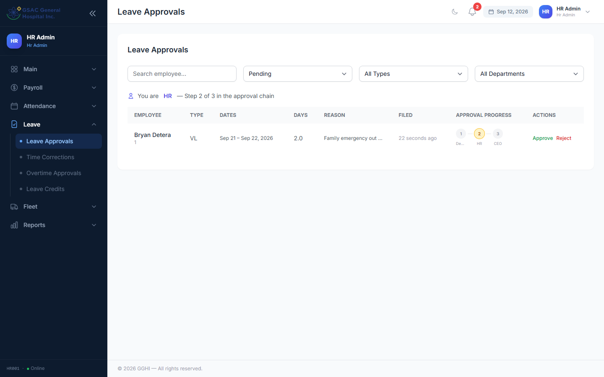

### B.3 Approving Time Corrections

Same flow as leave: **Admin → Time Corrections**, review the AM/PM in/out values being requested against the biometric record, then Approve/Reject with remarks. Approved corrections immediately affect that day's computed attendance (hours, lateness, status) and any payroll not yet finalized for that period.

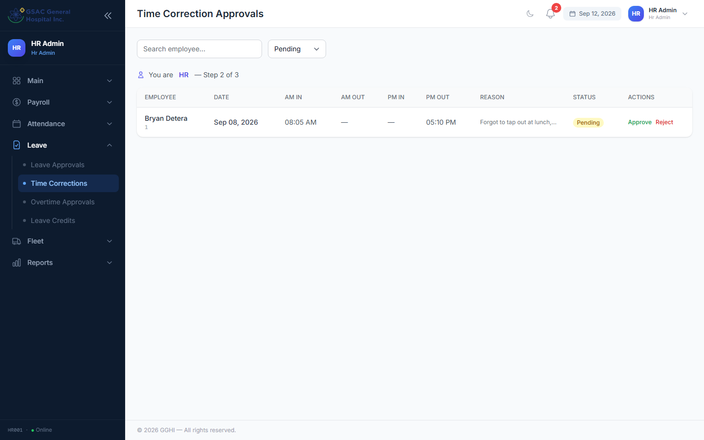

### B.4 Approving Trip Tickets

**Admin → Fleet Requests**

- Steps 1–2 (Immediate Head, HR) simply approve or reject like leave requests.
- **Step 3 (Fleet)** is special: when approving, you can optionally **assign a Vehicle and Driver** right in the approval modal. Leaving them blank keeps "to be assigned" and someone can assign later by editing the ticket.
- Once a trip is approved and completed, use **Mark Returned** on the approved ticket to close it out (marks the vehicle available again).

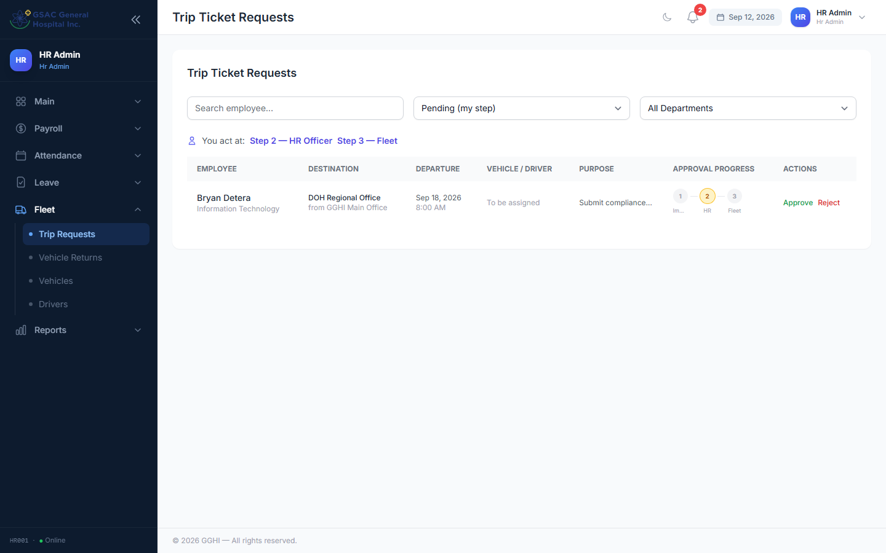

### B.5 Approving Overtime *(HR / Super Admin)*

**Admin → Overtime** — review requested hours and reason, then Approve (you may adjust the **Approved Hours** down from what was requested) or Reject with remarks.

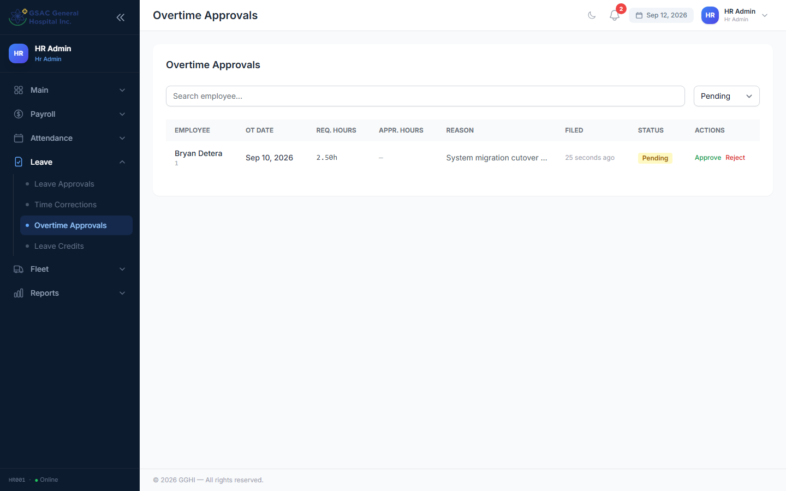

### B.6 Manager / Department Head Approving Their Own Team

As a Step-1 approver, you'll typically only see requests from employees in your reporting line. Filing your **own** leave/trip-ticket request automatically skips Step 1 and goes straight to HR/final approval, since you can't approve yourself.

### B.7 HR Admin — Additional Responsibilities

If you're an HR Admin, you also manage (via the Admin sidebar):
- **Employees, Departments, Positions** — records and org structure
- **Schedules & Day-offs** — shift templates and rest-day assignment
- **Payroll & Salary** — periods, payslip generation, salary rates, deductions (loans, SSS, PhilHealth, Pag-IBIG, etc.)
- **Holidays** — company-wide holiday calendar (auto-applied to attendance)
- **Leave Credits** — yearly credit allocation and monthly accrual
- **Biometrics** — BioTime/ZKTeco device sync and punch logs
- **Reports** — attendance, late, leave, overtime, and payroll reports (exportable to Excel/PDF/print)

### B.8 Super Admin — Full Access

Super Admins have all HR Admin capabilities plus:
- **User Accounts** (create/deactivate logins, reset passwords, change roles)
- **Roles & Permissions**

---

## 3. Common Questions

**Q: My leave shows "Not your step" even though I'm an approver.**
A: The request hasn't reached your step yet, or it's already past it. Check the progress chain on the request to see where it currently sits.

**Q: I rejected a request by mistake.**
A: Rejections can't be undone from the portal. Ask the employee to file a new request, or have an HR Admin correct the record directly.

**Q: The wrong time-in shows on my attendance.**
A: File a **Time Correction** ([A.4](#a4-requesting-a-time-correction)) rather than waiting — approvers cannot edit raw biometric punches, only approve a correction on top of them.

**Q: Can I file leave/trip tickets for someone else?**
A: No — each employee files their own requests from their own account. HR can create records manually only in exceptional cases.

**Q: Why is my payslip not showing yet?**
A: Payslips only appear once HR has generated (and usually finalized) the payroll period. Contact HR if a period is overdue.

---

*Questions not covered here? Contact your HR Admin.*
